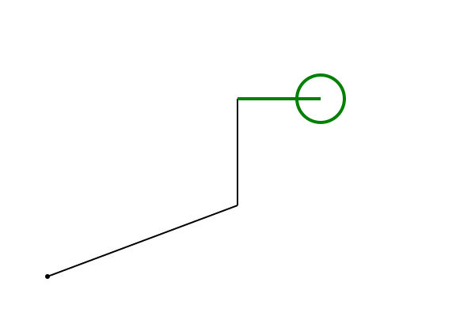

# telecran

Émulateur du célèbre jeu de télécran des années 70.
Le dessin est exécuté au moyen de commandes python
qui reproduisent les déplacements du télécran:

```python
from telecran import Telecran

t = Telecran()
t.MoveTo(0,0)
t.LineTo(10,2)
t.VLineTo(7)

t.Pencil.lineColor = "green"
t.Pencil.lineWidth = 4

t.HLineLong(10)

t.Display()
```

La dernière instruction affiche le résultat:


